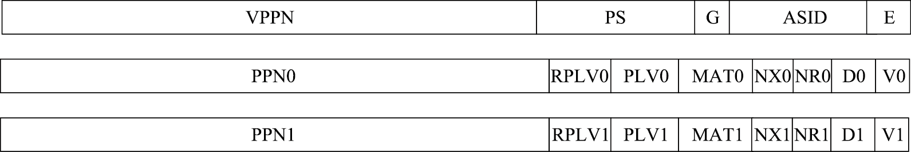

LoongArch 存储管理的硬件机制
========================================================

本节导读
--------------------------

在上一小节中我们已经简单介绍了分页的内存管理策略，现在我们尝试在 LoongArch 64 架构提供的 SV39 分页硬件机制的基础上完成内核中的软件对应实现。由于内容过多，我们将分成三个小节进行讲解。本节主要讲解 LoongArch 存储管理的硬件机制。

TLB 的结构和使用
------------------------------

地址空间和地址翻译模式
^^^^^^^^^^^^^^^^^^^^^^^^^^^^^^^^^^^^^^

在介绍 LoongArch 指令系统中 TLB 相关的存储管理的机制前，首先简要了解一下 LoongArch 中地址空间和地址翻译模式的基本内容。LoongArch 处理器支持的内存物理地址空间范围表示为 :math:`0 ‑ 2^{PALEN ‑ 1}` 。在 LA32 架构下，PALEN 理论上是一个不超过 36 的正整数；在 LA64 架构下，PALEN 理论上是一个不超过 60 的正整数。

LoongArch 指令系统中的虚拟地址空间是线性平整的。对于 PLV0 级来说，LA32 架构下虚拟地址空间大小为 :math:`2^{32}` 字节，LA64 架构下虚拟地址空间大小为 :math:`2^{64}` 字节。不过对于 LA64 架构来说，:math:`2^{64}` 字节大小的虚拟地址空间并不都是合法的，可以认为存在一些虚拟地址的空洞。合法的虚拟地址空间与地址映射模式紧密相关。

LoongArch 指令系统的 MMU 支持两种虚实地址翻译模式：直接地址翻译模式和映射地址翻译模式。在直接地址翻译模式下，物理地址默认直接等于虚拟地址（高位不足补 0、超出截断），此时可以认为整个虚拟地址空间都是合法的。当 CSR.CRMD 中的 DA 域为 1 且 PG 域为 0 时 CPU 处于直接地址翻译模式。CPU 复位结束后将进入直接地址翻译模式。当 CSR.CRMD 中的 DA 域为 0 且 PG 域为 1 时 CPU 处于映射地址翻译模式。映射地址翻译模式又分为直接映射地址翻译模式（简称 “直接映射模式”）和页表映射地址翻译模式（简称 “页表映射模式”）两种。在映射地址翻译模式下，地址翻译时将优先看其能否按照直接映射模式进行地址翻译，无法进行后再通过页表映射模式进行翻译。

.. _term-direct-map-mode:

直接映射模式通过直接映射配置窗口机制完成虚实地址翻译，简单来说就是将一大段连续的虚地址空间线性连续地映射至一段相同大小的物理地址空间。这里被翻译的一整段地址空间的大小通常远大于页表映射模式下所使用的页的大小，因此需要的配置信息更少。LoongArch 中将一对直接映射关系称为一个直接映射配置窗口，共定义了四个直接映射配置窗口。四个窗口的配置信息存于 CSR.DMW0~CSR.DMW3 中，每个窗口的配置信息包含该窗口对应的地址范围、该窗口在哪些权限等级下可用以及该窗口上的访存操作的存储访问类型。

LoongArch 指令系统中的页表映射模式，顾名思义，通过页表映射完成虚实地址转换。在该模式下，合法虚拟地址的 [63:PALEN] 位必须与 [PALEN‑1] 位相同，即虚地址第 [PALEN‑1] 位之上的所有位是该位的符号扩展。

TLB 结构
^^^^^^^^^^^^^^^^

页表映射模式存储管理的核心部件是 TLB。LoongArch 指令系统下 TLB 分为两个部分，一个是所有表项的页大小相同的单一页大小 TLB（Singular‑Page‑Size TLB，简称 STLB），另一个是支持不同表项的页大小可以不同的多重页大小 TLB（Multiple‑Page‑Size TLB，简称 MTLB）。STLB 的页大小可通过 STLBPS 控制寄存器进行配置。在虚实地址转换过程中，STLB 和 MTLB 同时查找。相应地，软件需保证不会出现 MTLB 和 STLB同时命中的情况，否则处理器行为将不可知。MTLB 采用全相联查找表的组织形式，STLB 采用多路组相联的组织形式。对于 STLB，如果其有 2INDEX 组，且配置的页大小为 2PS 字节，那么硬件查询 STLB 的过程中，是将虚地址的 :math:`PS + INDEX : PS` 位作为索引值来访问各路信息的。接下来介绍 LoongArch64 指令系统中 TLB 单个表项的结构，如下图所示。

在 TLB 表项中，E 表示该 TLB 表项是否存在，E 为 0 的项在进行 TLB 查找时将被视为无效项；ASID标记该 TLB 表项属于哪个地址空间，只有 CPU 中当前的 ASID（由 CSR.ASID 的 ASID 域决定）与该域相同时才能命中，ASID 用于区分不同进程的页表；G 位域表示全局域，为 1 时关闭 ASID 匹配，表示该 TLB 表项适用于所有的地址空间；PS 表示该页表项中存放的页大小，数值是页大小的 2 的幂指数，有 6 比特宽，因此 LoongArch 指令系统的页大小理论上可以任意变化，处理器可以实现其中的一段范围；VPPN 表示虚双页号，在 LoongArch 指令系统中，TLB 的每项把两个连续的虚拟页映射为两个物理页；PPN 为物理页号，这个域的实际有效宽度取决于该处理器支持的物理内存空间的大小；PLV 表示该页表项对应的权限等级；RPLV 为受限权限等级使能，当 RPLV=0 时，该页表项可以被任何权限等级不低于 PLV 的程序访问，否则，该页表项仅可以被权限等级等于 PLV 的程序访问； MAT 控制落在该页表项所在地址空间上的访存操作的存储访问类型，如是否可通过 Cache 缓存等； NX 为不可执行位，为 1 表示该页表项所在地址空间上不允许执行取指操作；NR 为不可读位，为 1 表示该页表项所在地址空间上不允许执行 load 操作；D 被称为 “脏”（Dirty）位，为 1 表示该页表项所对应的地址范围内已有脏数据；V 为有效位，为 1 表明该页表项是有效且被访问过的。

TLB 虚实地址翻译过程
^^^^^^^^^^^^^^^^^^^^^^^^^^^^^^^^^^^^

用 TLB 进行虚实地址翻译时，首先要进行 TLB 查找，将待查虚地址 vaddr 和 CSR.ASID 中 ASID 域的值 asid 一起与 STLB 中每一路的指定索引位置项以及 MTLB 中的所有项逐项进行比对。如果 TLB 表项的 E 位为 1，且 vaddr 对应的虚双页号 vppn 与 TLB 表项的 VPPN 相等（该比较需要根据 TLB 表项对应的页大小，只比较地址中属于虚页号的部分），且 TLB 表项中的 G 位为 1 或者 asid 与 TLB 表项的 ASID 域的值相等，那么 TLB 查找命中该 TLB 表项。如果没有命中项，则触发 TLB 重填异常（TLBR）。

如果查找到一个命中项，那么根据命中项的页大小和待查虚地址确定 vaddr 具体落在双页中的哪一页，从奇偶两个页表项取出对应页表项作为命中页表项。如果命中页表项的 V 等于 0，说明该页表项无效，将触发页无效异常，具体将根据访问类型触发对应的 load 操作页无效异常（PIL）、store 操作页无效异常（PIS）或取指操作页无效异常（PIF）。如果命中页表项的 V 值等于 1，但是访问的权限等级不合规，将触发页权限等级不合规异常（PPI）。权限等级不合规体现为，该命中页表项的 RPLV 值等于 0 且 CSR.CRMD 中 PLV 域的值大于命中页表项中的 PLV 值，或是该命中页表项的 RPLV=1 且 CSR.CRMD 中 PLV 域的值不等于命中页表项中的 PLV 值。如果上述检查都合规，还要进一步根据访问类型进行检查。如果是一个 load 操作，但是命中页表项中的 NR 值等于 1, 将触发页不可读异常（PNR）；如果是一个 store 操作，但是命中页表项中的 D 值等于 0, 将触发页修改异常（PME）；如果是一个取指操作，但是命中页表项中的 NX 值等于 1, 将触发页不可执行异常（PNX）。如果找到了命中项且经检查上述异常都没有触发，那么命中项中的 PPN 值和 MAT 值将被取出，前者用于和 vaddr 中提取的页内偏移拼合成物理地址 paddr，后者用于控制该访问操作的内存访问类型属性。

当触发 TLB 重填异常时，除了更新 CSR.CRMD 外，CSR.CRMD 中 PLV、IE 域的旧值将被记录到 CSR.TLBRPRMD 的相关域中，异常返回地址也将被记录到 CSR.TLBRERA 的 PC 域中，5 处理器还会将引发该异常的访存虚地址填入 CSR.TLBRBAV 的 VAddr 域并从该虚地址中提取虚双页号填入 CSR.TLBREHI 的 VPPN 域。当触发非 TLB 重填异常的其他 TLB 类异常时，除了像普通异常发生时一样更新 CRMD、PRMD 和 ERA 这些控制状态寄存器的相关域外，处理器还会将引发该异常的访存虚地址填入 CSR.BADV 的 VAddr 域并从该虚地址中提取虚双页号填入 CSR.TLBEHI 的 VPPN 域。

TLB 相关控制状态寄存器
^^^^^^^^^^^^^^^^^^^^^^^^^^^^^^^^^^^^^^

除了上面提到的 TLB 查找操作外，LoongArch 指令系统中定义了一系列用于访问和控制 TLB 的控制状态寄存器，用于 TLB 内容的维护操作。LoongArch 指令系统中用于访问和控制 TLB 的控制状态寄存器大致可以分为三类：第一类用于非 TLB 重填异常处理场景下的 TLB 访问和控制，包括 TLBIDX、TLBEHI、TLBELO0、TLBELO1、ASID 和 BADV；第二类用于 TLB 重填异常处理场景，包括此场景下 TLB 访问控制专用的 TLBREHI、TLBRELO0、TLBRELO1 和 TLBRBADV 以及此场景下保存上下文专用的 TLBRPRMD、TLBRERA 和 TLBRSAVE；第三类用于控制页表遍历过程，包括 PGDL、PGDH、PGD、PWCL 和 PWCH。三类寄存器的具体格式如下图所示。

上述寄存器中，第二类专用于 TLB 重填异常处理场景（CSR.TLBRERA 的 IsTLBR 域值等于 1）的控制寄存器，其设计目的是确保在非 TLB 重填异常处理程序执行过程中嵌套发生 TLB 重填异常处理后，原有异常处理程序的上下文不被破坏。例如，当发生 TLB 重填异常时，其异常处理返回地址将填入 CSR.TLBRERA 而非 CSR.ERA，这样被嵌套的异常处理程序返回时所用的返回目标就不会被破坏。因硬件上只维护了这一套保存上下文专用的寄存器，所以需要确保在 TLB 重填异常处理过程中不再触发 TLB 重填异常，为此，处理器因 TLB 重填异常触发而陷入异常处理后，硬件会自动将虚实地址翻译模式调整为直接地址翻译模式，从而确保 TLB 重填异常处理程序第一条指令的取指和访存一定不会触发 TLB 重填异常，与此同时，软件设计人员也要保证后续 TLB 重填异常处理返回前的所有指令的执行不会触发 TLB 重填异常。

在访问和控制 TLB 的控制状态寄存器中，ASID 中的 ASID 域、TLBEHI 中的 VPPN 域、TLBELO0 和 TLBELO1 中的所有域、TLBIDX 中的 PS 和 E 域所构成的集合对应了一个 TLB 表项中的内容（除了 TLB 表项中的 G 位域），ASID 中的 ASID 域、TLBREHI 中的 VPPN 和 PS 域、TLBRELO0 和 TLBRELO1 中的所有域所构成的集合也对应了一个 TLB 表项中的内容（除了 G 位域和 E 位域）。这两套控制状态寄存器都用来完成 TLB 表项的读写操作，前一套用于非 TLB 重填异常处理场景，而后一套仅用于 TLB 重填异常处理场景。写 TLB 时把上述寄存器中各个域存放的值写到 TLB 某一表项（将 TLBELO0 和 TLBELO1 的 G 位域相与或者将 TLBRELO0 和 TLBRELO1 的 G 位域相与后写入 TLB 表项的 G 位域），读 TLB 时将 TLB 表项读到并写入上述寄存器中的对应域（将 TLB 表项的 G 位域的值同时填入 TLBELO0 和 TLBELO1 的 G 位域，或者同时填入 TLBRELO0 和 TLBRELO1 的 G 位域）。
上述第三类寄存器的工作及使用方式将在后面3.3.3节中予以介绍。

TLB 访问和控制指令
^^^^^^^^^^^^^^^^^^^^^^^^^^^^^^^^

为了对 TLB 进行维护，除了上面提到的 TLB 相关控制状态寄存器外，LoongArch 指令系统中还定义了一系列 TLB 访问和控制指令，主要包括 TLBRD、TLBWR、TLBFILL、TLBSRCH 和 INVTLB。

TLBRD 是读 TLB 的指令，其用 CSR.TLBIDX 中 Index 域的值作为索引读出指定 TLB 表项中的值并将其写入 CSR.TLBEHI、CSR.TLBELO0、CSR.TLBELO1 以及 CSR.TLBIDX 的对应域中。

TLBWR 是写 TLB 的指令，其用 CSR.TLBIDX 中 Index 域的值作为索引将 CSR.TLBEHI、CSR.TLBELO0、CSR.TLBELO1 以及 CSR.TLBIDX 相关域的值（当处于 TLB 重填异常处理场景时，这些值来自 CSR.TLBREHI、CSR.TLBRELO0 和 CSR.TLBRELO1）写到对应的 TLB 表项中。

TLBFILL 是填入 TLB 的指令，其将 CSR.TLBEHI、CSR.TLBELO0、CSR.TLBELO1 以及 CSR.TLBIDX 相关域的值（当处于 TLB 重填异常处理场景时，这些值来自 CSR.TLBREHI、CSR.TLBRELO0 和 CSR.TLBRELO1）填入 TLB 中的一个随机位置。该位置的具体确定过程是，首先根据被填入页表项的页大小来决定是写入 STLB 还是 MTLB。当被填入的页表项的页大小与 STLB 所配置的页大小（由 CSR.STLBPS 中 PS 域的值决定）相等时将被填入 STLB，否则将被填入 MTLB。页表项被填入 STLB 的哪一路，或者被填入 MTLB 的哪一项，是由硬件随机选择的。

TLBSRCH 为 TLB 查找指令，其使用 CSR.ASID 中 ASID 域和 CSR.TLBEHI 中 VPPN 域的信息（当处于 TLB 重填异常处理场景时，这些值来自 CSR.ASID 和 CSR.TLBREHI）去查询 TLB。如果有命中项，那么将命中项的索引值写入 CSR.TLBIDX 的 Index 域，同时将其 NE 位置为 0；如果没有命中项，那么将该寄存器的 NE 位置 1。

INVTLB 指令用于无效 TLB 中符合条件的表项，即从通用寄存器 rj 和 rk 得到用于比较的 ASID 和虚地址信息，依照指令 op 立即数指示的无效规则，对 TLB 中的表项逐一进行判定，符合条件的 TLB 表项将被无效掉。

TLB 地址翻译相关异常的处理
----------------------------------------------

上一节介绍了 LoongArch 指令系统中与 TLB 相关的硬件规范，这些设计为操作系统提供了必要的支持，而存储管理则需要 CPU 和操作系统紧密配合，CPU 硬件在使用 TLB 进行地址翻译的过程中将产生相关异常，再由操作系统介入进行异常处理。本节将重点讲述这些异常处理的过程。

多级页表结构
^^^^^^^^^^^^^^^^^^^^

页表的一种最简单的实现是线性表，也就是按照地址从低到高、输入的虚拟页号从 :math:`0` 开始递增的顺序依次在内存中（我们之前提到过页表的容量过大无法保存在 CPU 中）放置每个虚拟页号对应的页表项。由于每个页表项的大小是 :math:`8` 字节，我们只要知道第一个页表项（对应虚拟页号 :math:`0` ）被放在的物理地址 :math:`\text{base_addr}` ，就能直接计算出每个输入的虚拟页号对应的页表项所在的位置。如下图所示：

.. image:: linear-table.png
    :height: 400
    :align: center

事实上，对于虚拟页号 :math:`i` ，如果页表（每个应用都有一个页表，这里指其中某一个）的起始地址为 :math:`\text{base_addr}` ，则这个虚拟页号对应的页表项可以在物理地址 :math:`\text{base_addr}+8i` 处找到。这使得 MMU 的实现和内核的软件控制都变得非常简单。然而遗憾的是，这远远超出了我们的物理内存限制。由于虚拟页号有 :math:`2^{33}` 种，每个虚拟页号对应一个 :math:`8` 字节的页表项，则每个页表都需要消耗掉 :math:`64\text{GiB}` 内存！应用的数据还需要保存在内存的其他位置，这就使得每个应用要吃掉 :math:`64\text{GiB}` 以上的内存，因此从空间占用角度来说，这种线性表实现是完全不可行的。

线性表的问题在于：它保存了所有虚拟页号对应的页表项，但是高达 :math:`256\text{TiB}` 的地址空间中真正会被应用使用到的只是其中极小的一个子集（本教程中的应用内存使用量约在数十~数百 :math:`\text{KiB}` 量级），也就导致有意义并能在页表中查到实际的物理页号的虚拟页号在 :math:`2^{33}` 中也只是很小的一部分。由此线性表的绝大部分空间其实都是被浪费掉的。

那么如何进行优化呢？核心思想就在于 **按需分配** ，也就是说：有多少合法的虚拟页号，我们就维护一个多大的映射，并为此使用多大的内存用来保存映射。这是因为，每个应用的地址空间最开始都是空的，或者说所有的虚拟页号均不合法，那么这样的页表自然不需要占用任何内存， MMU 在地址转换的时候无需关心页表的内容而是将所有的虚拟页号均判为不合法即可。而在后面，内核已经决定好了一个应用的各逻辑段存放位置之后，它就需要负责从零开始以虚拟页面为单位来让该应用的地址空间的某些部分变得合法，反映在该应用的页表上也就是一对对映射顺次被插入进来，自然页表所占据的内存大小也就逐渐增加。

这种 **按需分配** 思想在计算机科学中得到了广泛应用：为了方便接下来的说明，我们可以举一道数据结构的题目作为例子。设想我们要维护一个字符串的多重集，集合中所有的字符串的字符集均为 :math:`\alpha=\{a,b,c\}` ，长度均为一个给定的常数 :math:`n` 。该字符串集合一开始为空集。我们要支持两种操作，第一种是将一个字符串插入集合，第二种是查询一个字符串在当前的集合中出现了多少次。

.. _term-trie:

简单起见，假设 :math:`n=3` 。那么我们可能会建立这样一颗 **字典树** (Trie) ：

.. image:: trie.png

字典树由若干个节点（图中用椭圆形来表示）组成，从逻辑上而言每个节点代表一个可能的字符串前缀。每个节点的存储内容都只有三个指针，对于蓝色的非叶节点来说，它的三个指针各自指向一个子节点；而对于绿色的叶子节点来说，它的三个指针不再指向任何节点，而是具体保存一种可能的长度为 :math:`n` 的字符串的计数。这样，对于题目要求的两种操作，我们只需根据输入的字符串中的每个字符在字典树上自上而下对应走出一步，最终就能够找到字典树中维护的它的计数。之后我们可以将其直接返回或者加一。

注意到如果某些字符串自始至终没有被插入，那么一些节点没有存在的必要。反过来说一些节点是由于我们插入了一个以它对应的字符串为前缀的字符串才被分配出来的。如下图所示：

.. image:: trie-1.png

一开始仅存在一个根节点。在我们插入字符串 ``acb`` 的过程中，我们只需要分配 ``a`` 和 ``ac`` 两个节点。注意 ``ac`` 是一个叶节点，它的 ``b`` 指针不再指向另外一个节点而是保存字符串 ``acb`` 的计数。此时我们无法访问到其他未分配的节点，如根节点的 ``b/c`` 或是 ``a`` 节点的 ``a/b`` 均为空指针。如果后续再插入一个字符串，那么 **至多分配两个新节点** ，因为如果走的路径上有节点已经存在，就无需重复分配了。这可以说明，字典树中节点的数目（或者说字典树消耗的内存）是随着插入字符串的数目逐渐线性增加的。

同学可能很好奇，为何在这里要用相当一部分篇幅来介绍字典树呢？事实上 LoongArch 分页机制等价于一颗字典树。 :math:`33` 位的虚拟页号可以看成一个长度 :math:`n=3` 的字符串，字符集为 :math:`\alpha=\{0,1,2,...,2048\}` ，因为每一位字符都由 :math:`11` 个比特组成。而我们也不再维护所谓字符串的计数，而是要找到字符串（虚拟页号）对应的页表项。因此，每个叶节点都需要保存 :math:`2048` 个 :math:`8` 字节的页表项，一共正好 :math:`16\text{KiB}` ，可以直接放在一个物理页帧内。而对于非叶节点来说，从功能上它只需要保存 :math:`2048` 个指向下级节点的指针即可，不过我们就像叶节点那样也保存 :math:`2048` 个页表项，这样每个节点都可以被放在一个物理页帧内，节点的位置可以用它所在物理页帧的物理页号来代替。当想从一个非叶节点向下走时，只需找到当前字符对应的页表项的物理页号字段，它就指向了下一级节点的位置，这样非叶节点中转的功能也就实现了。每个节点的内部是一个线性表，也就是将这个节点起始物理地址加上字符对应的偏移量就找到了指向下一级节点的页表项（对于非叶节点）或是能够直接用来地址转换的页表项（对于叶节点）。

.. _term-multi-level-page-table:
.. _term-page-index:

这种页表实现被称为 **多级页表** (Multi-Level Page-Table) 。由于我们的实验中虚拟页号被分为三级 **页索引** (Page Index) ，因此这是一种三级页表。

Linux 操作系统通常采用多级页表结构。对于 64 位的 LoongArch 处理器，如果其有效虚地址位宽为 48 位，那么当 Linux 操作系统采用 16KB 页大小时，其页表为三级结构，如下图所示。33 位的虚双页号（VPPN）分为三个部分：最高 11 位作为一级页表（页目录表 PGD）索引，一级页表中每一项保存一个二级页表（页目录表 PMD）的起始地址；中间 11 位作为二级页表索引，二级页表中每一项保存一个三级页表（末级页表 PTE）的起始地址；最低 11 位作为三级页表索引。每个三级页表包含 2048 个页表项，每个页表项管理一个物理页，大小为 8 字节，包括 RPLV、NX、NR、PPN、W、P、G、MAT、PLV、D、V 的信息。“P” 和 “W” 两个域分别代表物理页是否存在，以及该页是否可写。这些信息虽然不填入 TLB 表项中，但用于页表遍历的处理过程。每个进程的 PGD 表基地址放在进程上下文中，内核进程进行切换时把 PGD 表的基地址写到 CSR.PGDH 的 Base 域中，用户进程进行切换时把 PGD 表的基地址写到 CSR.PGDL 的 Base 域中。

.. _term-tlbr-handle:

TLB 重填异常处理
^^^^^^^^^^^^^^^^^^^^^^^^^^^^

当 TLB 重填异常发生后，其异常处理程序的主要处理流程是根据 CSR.TLBRBADV 中 VAddr 域记录的虚地址信息以及从 CSR.PGD 中得到的页目录表 PGD 的基址信息，遍历发生 TLB 重填异常的进程的多级页表，从内存中取回页表项信息填入 CSR.TLBRELO0 和 CSR.TLBRELO1 的相应域中，最终用 TLBFILL 指令将页表项填入 TLB。前面在讲述 TLBFILL 指令写操作过程时，提到此时写入 TLB 的信息除了来自 CSR.TLBRELO0 和 CSR.TLBRELO1 的各个域之外，还有来自 CSR.ASID 中 ASID 域和 CSR.TLBREHI 中 VPPN 域的信息。在 TLB 重填异常从发生到进行处理的过程中，软硬件都没有修改 CSR.ASID 中的 ASID 域，所以在执行 TLBFILL 指令时，CSR.ASID 中的 ASID 域记录的就是发生 TLB 重填异常的进程对应的 ASID。至于 CSR.TLBREHI 中的 VPPN 域，在 TLB 重填异常发生并进入异常入口时，已经被硬件填入了触发该异常的虚地址中的虚双页号信息。

整个 TLB 重填异常处理过程中，遍历多级页表是一个较为复杂的操作，需要数十条普通访存、运算指令才能完成，而且如果遍历的页表级数增加，则需要更多的指令。LoongArch 指令系统中定义了 LDDIR 和 LDPTE 指令以及与之配套的 CSR.PWCL 和 CSR.PWCH 来加速 TLB 重填异常处理中的页表遍历。LDDIR 和 LDPTE 指令的功能简述如下表所示。

.. list-table:: **LoongArch 软件页表遍历指令**
    :widths: 30 70
    :header-rows: 1

    * - 指令
      - 描述
    * - ``LDDIR rd, rj, level``
      - 将 rj 寄存器中的值作为当前页目录表的基地址，同时根据 CSR.TLBRBADV 中 VAddr 域存放的 TLB 缺失地址以及 PWCL、PWCH 寄存器中定义的页目录表 level 索引的起始位置和位宽信息计算出当前目录页表的偏移量，两者相加作为访存地址，从内存中读取待访问页目录表/页表的基址，写入 rd 寄存器中。
    * - ``LDPTE rj, seq``
      - 将 rj 寄存器中的值作为末级页表的基地址，同时根据 CSR.TLBRBADV 中 VAddr 域存放的 TLB 缺失地址以及 PWCL、PWCH 寄存器中定义的末级页表索引的起始位置和位宽信息计算出末级页表的偏移量，两者相加作为访存地址，从内存中读取偶数号 (seq=0) 或奇数号 (seq=1) 页表项的内容，将其写入到 TLBRELO0 或 TLBRELO1 寄存器中。

CSR.PWCL 和 CSR.PWCH 用来配置 LDDIR 和 LDPTE 指令所遍历页表的规格参数信息，其中 CSR.PWCL 中定义了每个页表项的宽度（PTEwidth 域）以及末级页表索引的起始位置和位宽（PTbase 和 PTwidth 域）、页目录表 1 索引的起始位置和位宽（Dir1_base 和 Dir1_width 域）、页目录表 2 索引的起始位置和位宽（Dir2_base 和 Dir2_width 域）,CSR.PWCH 中定义了页目录表 3 索引的起始位置和位宽（Dir3_base 和 Dir3_width 域）、页目录表 4 索引的起始位置和位宽（Dir4_base 和 Dir4_width 域）。在 Linux/LoongArch64 中，当进行三级页表的遍历时，通常用 Dir1_base 和 Dir1_width 域来配置页目录表 PMD 索引的起始位置和位宽，用 Dir3_base 和 Dir3_width 域来配置页目录表 PGD 索引的起始位置和位宽，Dir2_base 和 Dir2_width 域、Dir4_base 和 Dir4_width 域空闲不用。

使用上述指令，TLB 重填异常处理程序如下。可见，遍历一个三级页表的处理过程只需要执行 9 条指令，且每增加一级页表只需增加一条 LDDIR 指令即可。

.. code-block:: asm
    :linenos:

    csrwr $t0, CSR_TLBRSAVE
    csrrd $t0, CSR_PGDlddir$t0, $t0, 3  # 访问页目录表 PGD
    lddir $t0, $t0, 1  # 访问页目录表 PMD
    ldpte $t0, 0  # 取回偶数号页表项
    ldpte $t0, 1  # 取回奇数号页表项
    tlbfill
    csrrd $t0, CSR_TLBRSAVE
    ertn

其它 TLB 地址翻译相关异常处理
^^^^^^^^^^^^^^^^^^^^^^^^^^^^^^^^^^^^^^^^^^^^^^^^^^

除了 TLB 重填异常外，LoongArch 指令系统下常见的 TLB 类异常有取指操作页无效异常、load 操作页无效异常、store 操作页无效异常和页修改异常。这四种异常在 Linux/LoongArch 中处理的伪代码如下所示，其中取指操作页无效异常和 load 操作页无效异常的处理流程一致。伪代码中的 load pte 函数遍历页表并取得页表项，DO_FAULT 函数在内存中分配物理页并把该页内容从对换区中取到内存，_PAGE_PRESENT、_PAGE_READ 和 _PAGE_WRITE 分别表示相应的物理页是否在内存中、是否可读、是否可写。

.. code-block:: 
    :linenos:

    TLB modified exception:
    (1)load pte;
    (2)if(_PAGE_WRITE) set VALID|DIRTY, reload tlb, tlbwr;
    else DO_FAULT(1);
    TLB load exception:
    (1)load pte;
    (2)if(_PAGE_PRESENT && _PAGE_READ) set VALID, reload tlb, tlbwr;
    else DO_FAULT(0);
    80
    TLB store exception:
    (1)load pte;
    (2)if(_PAGE_PRESENT && _PAGE_WRITE) set VALID|DIRTY, reload tlb, tlbwr;
    else DO_FAULT(1);

下面通过一个例子来深入分析处理器、操作系统以及应用程序间的交互。下面是一个分配数组和对数组赋值的小程序。从程序员的角度看，这个程序很简单，但从结构和操作系统的角度看，这个程序的执行却涉及复杂的软硬件交互过程。

.. code-block:: 
    :linenos:

    array=(int *)malloc(0x1000);
    for(i=0;i<1024;i++) array[i]=0;

该用户程序首先调用内存分配函数 malloc 来分配大小为 0x1000 字节的空间，假设返回一个虚地址 0x450000。操作系统在进程的 vma_struct 链表里记录地址范围 0x450000~0x451000 为已分配地址空间，并且是可读、可写的。但操作系统只是分配了一个地址范围，还没有真实分配内存的物理空间，也没有在页表里建立页表项，TLB 里更没有⸺因为如果进程没有访问，就不用真为其分配物理空间。接下来的 for 循环对数组 array 进行赋值，用户程序写地址为 0x450000 的单元。store 操作在完成地址运算后查找 TLB，由于 TLB 里面没有这一表项，因此引起 TLB 重填异常。TLB 重填异常处理程序从相应的页表位置取页表内容填入 TLB，但此时这个地址空间的页表还没有有效的页表项信息。当异常处理返回用户程序重新开始访问时，TLB 里面有了对应的虚地址，但是还没有物理地址。因为还没有分配具体的物理空间，所以引起 store 操作页无效异常。处理 store 操作页无效异常时，操作系统需要查找 vma_struct 这个结构，如果判断出这个地址已经分配，处于可写状态，这时操作系统才真正分配物理页面，并分配物理页表，将物理地址填入页表，更新 TLB 相应的表项。store 操作页无效异常处理完成之后返回，store 操作再次执行，这次就成功了，因为 TLB 里已经有了相应的表项，并且是有效、可写的。由于分配的页面恰好为 4KB 大小，且在同一页中，因此后续的地址访问都会在 TLB 中命中，不会再产生异常。产生两次异常而非一次完成所有操作的原因是保证 TLB 重填异常的处理速度。